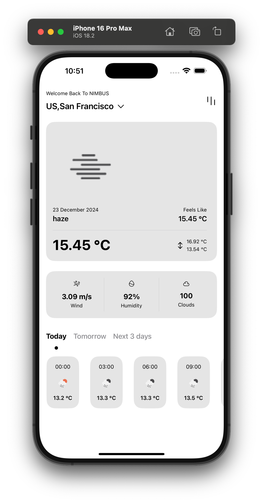
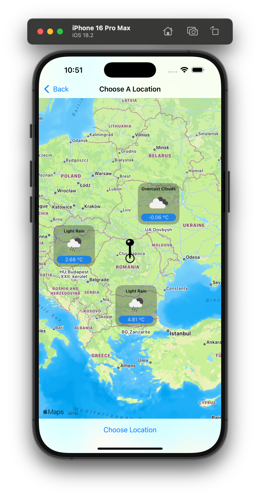
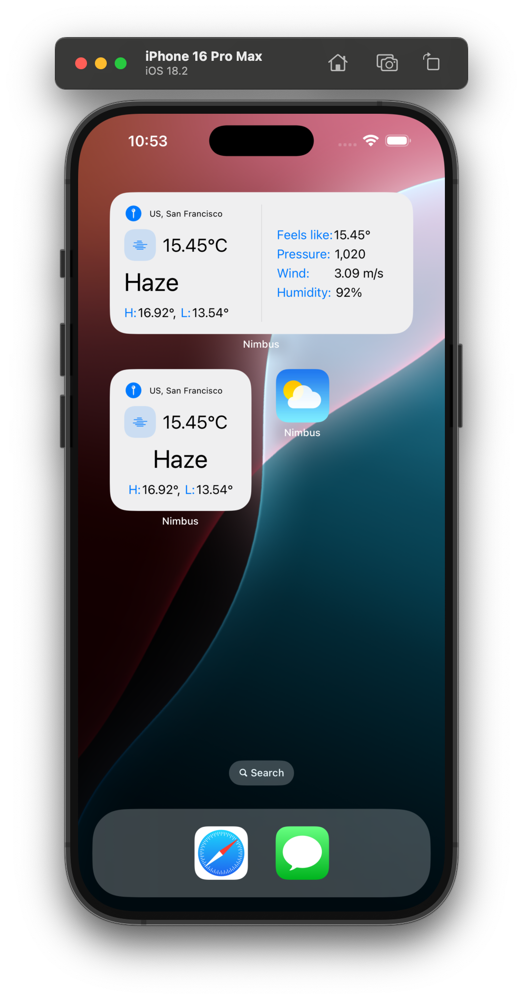

# Nimbus  
## Table of Contents  
- [Screenshots](#screenshots)  
- [Overview](#overview)  
- [Running the Application](#running-the-application)  
- [Technical Implementation](#technical-implementation)  
- [Features](#features) 

## Screenshots  

| Home Screen                            | Map View                               | Widgets                                |
|----------------------------------------|----------------------------------------|----------------------------------------|
|    |        |     |

## Overview  
**Nimbus** is a showcase iOS application designed to demonstrate expertise in building modern, scalable, and feature-rich mobile apps using SwiftUI. It highlights professional skills in clean architecture, RESTful API integration, and advanced iOS technologies, making it an ideal portfolio project for demonstrating technical proficiency. 

## Running the application:
To run the Nimbus application, follow these steps:
1. **Clone the Repository:**  
   Clone this repository to your local machine using the following command:  
   ```bash
   git clone https://github.com/mhdmoh/nimbus.git
   ```
2. **Build the Project:**  
  Open the project in Xcode and build it once. During this process, two essential files will be automatically generated:  
	•	EnvironmentVars.generated.swift: Contains generated code for environment variables.  
	• env.xcconfig: A configuration file for managing environment-specific settings.

3. **Add Your OpenWeatherMap API Key:**  
  Obtain your API key from [OpenWeatherMap](https://openweathermap.org/).
  Add the API key to the appropriate configuration to enable weather data retrieval.

## Technical Implementation  
Nimbus is built with a focus on clean, scalable, and maintainable code, leveraging cutting-edge iOS technologies and best practices:  

- **Clean Architecture:**  
  - Designed with a modular structure to separate concerns and enhance scalability.  
  - Layers include **Data Sources**, **Repositories**, and **Views**, adhering to Clean Architecture principles.  

- **RESTful API Integration:**  
  - Fetches weather data and forecasts using a RESTful API.  
  - Implements robust error handling and data parsing mechanisms for reliable network operations.  

- **Dependency Injection:**  
  - Implements dependency injection using the `Swinject` package to ensure flexibility and testability.  
  - Utilizes `GRDBQuery` to instantiate view models with injected dependencies, streamlining data flow and reducing coupling.  

- **Sourcery and API Key Management:**  
  - Utilizes the **Sourcery** Swift package to generate boilerplate code, ensuring consistency and reducing manual effort.  
  - Implements a secure and version-controlled approach for managing API keys using a combination of `.xcconfig` files and Sourcery-generated code.  
  - This setup ensures that sensitive information is kept out of version control while simplifying the integration of API keys into the project.  

- **MapKit Integration:**  
  - Displays an interactive map, allowing users to explore and select locations visually.  

- **CoreLocation:**  
  - Retrieves the user's current location to provide weather updates specific to their area.  

- **WidgetKit:**  
  - Includes a home screen widget that displays real-time weather details for the current location, improving user accessibility.  

## Features  

Nimbus offers a comprehensive set of features designed to enhance user experience:  

- **Real-Time Weather Updates:**  
  - Fetches and displays the current weather and forecast for the user's current location using RESTful API calls.  

- **Interactive Map Integration:**  
  - Allows users to select any location from the map and retrieve weather details for that region.  

- **Data Caching:**  
  - Caches the last known weather data for all selected locations, enabling offline access and quick load times.  

- **Map-Based Visualization:**  
  - Displays weather details for all saved locations directly on the map, providing a comprehensive overview.  

- **Home Screen Widgets:**  
  - Provides instant weather updates for the current location through iOS widgets, offering information at a glance.  
